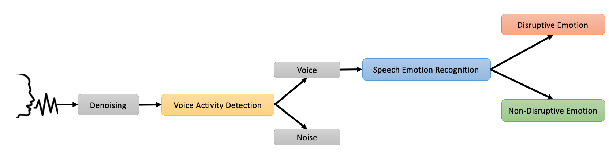

# ambient-intelligence
Python application for Disruptive Situations Detection in public transports through Speech Emotion Recognition. 


This project was developed in the context of my Master's thesis in [Artificial Intelligence @ University of Bologna](https://corsi.unibo.it/2cycle/artificial-intelligence). 

The aim of the thesis is to describe a study on the
application of Machine Learning and Deep Learning methods for Voice Activity Detection (VAD) and Speech Emotion Recognition (SER). 
The study is in the context of European project H2020 - 5GMED whose objective is to detect disruptive situations in 
public transports. To this end, we developed an architecture,  implemented a prototype and ran validation tests 
on a variety of options.

The architecture consists of several modules. 
The denoising module was realized through the use of a filter and the VAD module through an open-source toolkit, 
while the SER system was entirely developed in this thesis. 

For SER architecture we adopted the use of two audio features (MFCC and RMS) and two kind of classifiers, 
namely CNN and SVM, to detect emotions indicative  of disruptive situations such as fighting or shouting. 
We aggregated several models through ensemble learning. The ensemble was evaluated on several datasets and showed 
encouraging experimental results, even compared to the baselines of the state-of the-art.

## Prerequisites
**Library Name** | **Version**                         
---------------------------|----------------------------------------------
 argumentparsers           | 1.2.1                                        
 audioread                 | 2.1.9                                        
 inaSpeechSegmenter        | 0.6.8                                        
 jupyter                   | 1.0.0                                        
 kaggle                    | 1.5.12                                       
 keras                     | 2.6.0                                        
 librosa                   | 0.8.1                                        
 matplotlib                | 3.4.2                                        
 numpy                     | 1.19.5                                       
 numba                     | 0.53.1                                       
 pandas                    | 1.3.1                                        
 PyAudio                   | 0.2.11                                       
 pydub                     | 0.25.1                                       
 scikit-learn              | 0.24.2                                       
 scipy                     | 1.7.1                                        
 SoundFile                 | 0.10.3.post1                                 
 SpeechRecognition         | 3.8.1                                        
 tensorboard               | 2.6.0                                        
 tensorflow                | 2.6.0                                        
                            

## Usage
The application can be run from inside this folder through a UNIX terminal using the following command: `python3 main.py`

The arguments that need to be specified when running the script are:
- `-m`: to specify the method of execution. Possible options are:
  - `mic`: for local real-time execution. The audio is captured from the audio
interfaces of the laptop through the SpeechRecognition library for Python.
  - `file`: for offline execution. The audio is provided through a .wav audio file.
  - `real-mic`: for streaming execution in the real environment. The audio is provided by the microphone hosted on a CCTV camera. While the first two modes have been implemented, the last one has yet to be developed.
- `f`: to specify the audio file when `-m` file execution is enabled. After typing the `-f` option, the full path to an audio file should be provided.
- `-p`: to specify the aggregation strategy to be used when using the ensemble. Possible options are:
  - `voting`
  - `avg_1`
  - `avg_2`

Full command example: `python3 main.py -m file -f 'media/03-01-01-01-01-01-01_noise.wav'`

## License
This project is licensed under the MIT License - see the [LICENSE](https://github.com/helemanc/ambient-intelligence/blob/main/LICENSE) file for details.

## References 

Please, cite this work if you use it for your research or business.
```bibtex
@article{MANCINI2023200305,
title = {Disruptive Situation Detection on Public Transport through Speech Emotion Recognition},
journal = {Intelligent Systems with Applications},
pages = {200305},
year = {2023},
issn = {2667-3053},
doi = {https://doi.org/10.1016/j.iswa.2023.200305},
url = {https://www.sciencedirect.com/science/article/pii/S2667305323001308},
author = {Eleonora Mancini and Andrea Galassi and Federico Ruggeri and Paolo Torroni},
keywords = {Speech Emotion Recognition, Affective Computing, Natural Language Processing, Machine Learning, Data Augmentation}
}

```bibtex
@phdthesis{amslaurea24721,
title = {Disruptive Situations Detection on Public Transports through Speech Emotion Recognition},
author = {Eleonora Mancini},
keywords = {Speech Emotion Recognition,Speech Recognition,Voice Activity Detection,Machine Learning,Natural Language Processing,Deep Learning,Convolutional Neural Network,Support Vector Machine,MFCC},
url = {http://amslaurea.unibo.it/24721/}
}


